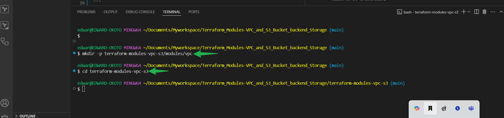
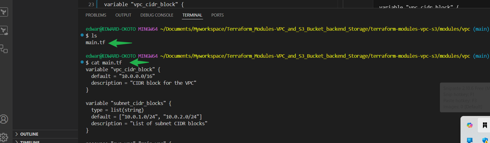
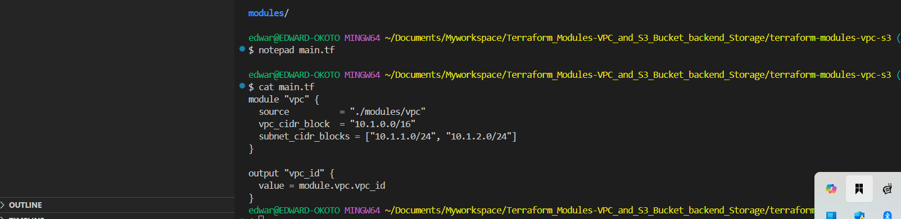
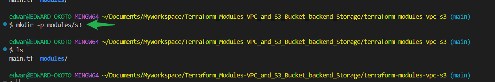
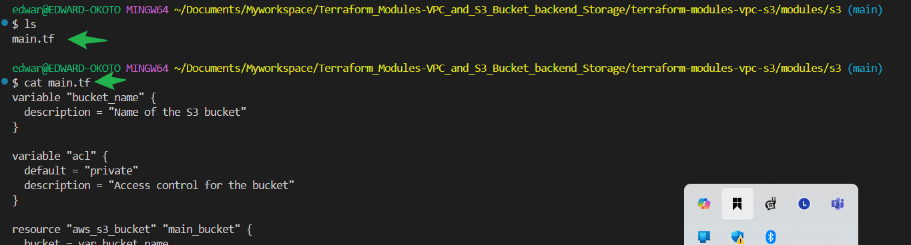

# Terraform Modules VPC and S3 Bucket backend Storage

## Purpose

Use Terraform to create modularized configurations for building an Amazon Virtual Private Cloud and an S3 bucket 

Configure Terraform to use Amazon S3 as the backend storage for storing the terraform statefile.

---
### **Task 1: VPC Module**

#### Step 1: Create Project and Directory for VPC Module
```bash
mkdir -p terraform-modules-vpc-s3/modules/vpc
cd terraform-modules-vpc-s3
```


#### Step 2: Create the `modules/vpc/main.tf` File
Write a Terraform module for the VPC with customizable configurations:



```hcl
variable "vpc_cidr_block" {
  default = "10.0.0.0/16"
  description = "CIDR block for the VPC"
}

variable "subnet_cidr_blocks" {
  type = list(string)
  default = ["10.0.1.0/24", "10.0.2.0/24"]
  description = "List of subnet CIDR blocks"
}

resource "aws_vpc" "main_vpc" {
  cidr_block = var.vpc_cidr_block
  tags = {
    Name = "MainVPC"
  }
}

resource "aws_subnet" "main_subnet" {
  count      = length(var.subnet_cidr_blocks)
  vpc_id     = aws_vpc.main_vpc.id
  cidr_block = element(var.subnet_cidr_blocks, count.index)
  tags = {
    Name = "MainSubnet-${count.index}"
  }
}

output "vpc_id" {
  value = aws_vpc.main_vpc.id
}
```

#### Step 3: Create `main.tf` in the Project Directory
Use the VPC module to create a VPC:

```hcl
module "vpc" {
  source          = "./modules/vpc"
  vpc_cidr_block  = "10.1.0.0/16"
  subnet_cidr_blocks = ["10.1.1.0/24", "10.1.2.0/24"]
}

output "vpc_id" {
  value = module.vpc.vpc_id
}
```

---

### **Task 2: S3 Bucket Module**

#### Step 1: Create a Directory for the S3 Bucket Module
```bash
mkdir -p modules/s3
```


#### Step 2: Write the `modules/s3/main.tf` File
Define the module for creating an S3 bucket:

```hcl
variable "bucket_name" {
  description = "Name of the S3 bucket"
}

variable "acl" {
  default = "private"
  description = "Access control for the bucket"
}

resource "aws_s3_bucket" "main_bucket" {
  bucket = var.bucket_name
  acl    = var.acl
  tags = {
    Name = "MainBucket"
  }
}

output "bucket_name" {
  value = aws_s3_bucket.main_bucket.bucket
}
```


#### Step 3: Modify `main.tf` to Use the S3 Bucket Module
Update the main Terraform configuration file to use the S3 module:

```hcl
module "s3" {
  source      = "./modules/s3"
  bucket_name = "example-s3-bucket-2025"
  acl         = "private"
}

output "bucket_name" {
  value = module.s3.bucket_name
}
```

---

### **Task 3: Backend Storage Configuration**

#### Step 1: Create `backend.tf` File
Specify the backend configuration for Terraform to use the S3 bucket to store the state:

```hcl
terraform {
  backend "s3" {
    bucket         = "example-s3-bucket-2025"
    key            = "terraform/state"
    region         = "us-east-1"
    encrypt        = true
  }
}
```

#### Step 2: Initialize Terraform with S3 Backend
Run the following commands to initialize and apply:
1. Initialize Terraform:
   ```bash
   terraform init
   ```

2. Apply the configuration to create resources:
   ```bash
   terraform apply
   ```
   Type `yes` when prompted.

---
`main.tf` in root directory.
---

```
module "vpc" {
  source             = "./modules/vpc"
  vpc_cidr_block     = "10.1.0.0/16"
  subnet_cidr_blocks = ["10.1.1.0/24", "10.1.2.0/24"]
}

output "vpc_id" {
  value = module.vpc.vpc_id
}

resource "aws_s3_bucket" "state_bucket" {
  bucket = "example-s3-bucket-2025" # Replace this with your preferred bucket name

  tags = {
    Name = "TerraformStateBucket"
  }
}

resource "aws_s3_bucket_policy" "state_bucket_policy" {
  bucket = aws_s3_bucket.state_bucket.id

  policy = jsonencode({
    Version = "2012-10-17"
    Statement = [
      {
        Sid    = "AllowSpecificUserAccess"
        Effect = "Allow"
        Action = "s3:*"
        Resource = [
          "${aws_s3_bucket.state_bucket.arn}/*",
          aws_s3_bucket.state_bucket.arn
        ]
        Principal = {
          AWS = "arn:aws:iam::491085391064:user/Edward"
        }
      }
    ]
  })

  # Ensure bucket policy depends on bucket creation
  depends_on = [aws_s3_bucket.state_bucket]
}

output "bucket_name" {
  value = aws_s3_bucket.state_bucket.bucket
}
```
Comment on the backend.tf code and ensure the S3 bucket is created first-Then remove the comments and run terraform init and apply again for the backend to take effect-

### Result:
- A VPC is created with the specified CIDR block and subnets.
- An S3 bucket is created with the defined name and ACL.
- Terraform uses the S3 bucket to store its state file securely.
